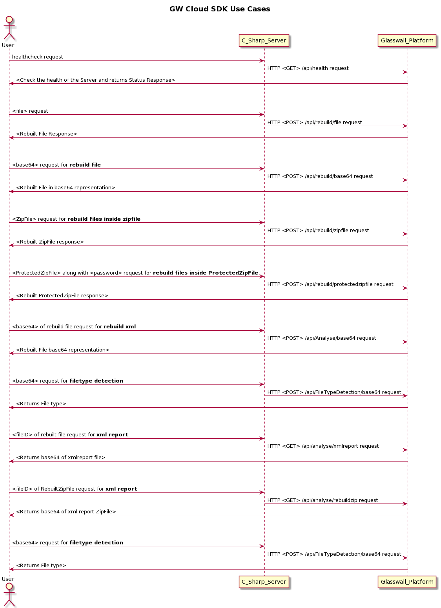

# C# Rest API for ICAP Service Kubernetes cluster

## The Project Overview

The project is about a Kubernetes service that can be added to [ICAP infrastructure](https://github.com/k8-proxy/icap-infrastructure) to provide access to Glasswall Solutions file rebuild service through RESTful APIs

## Architecture Diagram


- The C# service receives files for a rebuild on the REST API endpoints.  
- After preliminary processing (at least must verify the file has been received) the request is passed to the `Adaption Service` with `Adaption request` RabbitMQ     message.  
- The file to be rebuilt is uploaded to the `Original Store`.  
- Once the processing is completed C# service gets informed with a RabbitMQ `Adaption outcome` message.  
- C# service get the rebuilt file from the `Rebuild Store` and passes it to the user.  

## Dataflow Diagram



## The docker image

- Build the image with the following:  

    ```
    docker build -t cs-k8s-api --file Dockerfile .
    ```

- Tag the docker image:  

    ```
    docker image tag cs-k8s-api <dockerhub_repo>/cs-k8s-api:<version>
    ```

- Upload the tagged image to Docker Hub:  

    ```
    docker image push <dockerhub_repo>/cs-k8s-api:<version>
    ```

## Deployment within ICAP Service cluster

- Make sure you can connect to the cluster with `kubectl`  
- For the case of [AMI or OVA](https://github.com/k8-proxy/glasswall-servers-eval/wiki) just SSH to the EC2 instance or the VM
- For other deployments see [Accessing Clusters](https://kubernetes.io/docs/tasks/access-application-cluster/access-cluster/))

- Get [deployment.yaml](https://github.com/k8-proxy/cs-k8s-api/blob/main/deployment.yaml)

    ```
        wget https://raw.githubusercontent.com/k8-proxy/cs-k8s-api/main/deployment.yaml
    ```
- Replace `<REPLACE_IMAGE_ID>` within the file with the tagged (`<dockerhub_repo>/cs-k8s-api:<version>`) docker hub image created in the previous section  

- Run the following:

    ```
        kubectl -n icap-adaptation apply -f deployment.yaml
    ```

- The command above must create a Kubernetes service called `proxy-rest-api` that can be accessed at <Cluster_IPv4>:8080  

- Verify the service has been successfully created  

    ```
        kubectl -n icap-adaptation get svc
    ```

- The output should contain a line that looks like the following:

    ```
        ...
        proxy-rest-api              LoadBalancer   10.43.236.137   91.109.25.86   8080:30329/TCP
        ...
    ```

- Verify that the service POD is running  

    ```
        kubectl -n icap-adaptation get pods
    ```
- You should see the POD in the `Running` state  

    ```
        proxy-rest-api-7b7d5b6456-s44kq                         1/1     Running     0
    ```

## Implemented endpoints

#### api/FileTypeDetection/base64

The endpoint detects the uploaded file type

It accepts HTTP POST requests with:  

Headers:  
- Content-Type: application/json  

Payload:  
- base64 encoded file (see [base64.json](./Samples/base64.json))
  
On success, the output is JSON formated data like in the sample below:  
  
```
{
    "fileTypeName": "pdf",
    "fileSize": 189167
}
```
  
#### api/Analyse/base64

The endpoint analyses the file uploaded for a possibility to rebuild it.

It accepts HTTP POST requests with:  

Headers:  
- Content-Type: application/json  

Payload:  
- base64 encoded file (see [base64.json](./Samples/base64.json))
  
On success, the output is an XML formated report (see [report.xml](./Samples/report.xml))  

#### api/Rebuild/base64

The endpoint rebuilds the file uploaded.

It accepts HTTP POST requests with:  

Headers:  
- Content-Type: application/json  

Payload:  
- base64 encoded file (see [base64.json](./Samples/base64.json))
  
On success, the output is a base64 encoded cleaned up file  

### api/Rebuld/file

The endpoint rebuilds the file uploaded.

It accepts HTTP POST requests with:  

Headers:  
- Content-Type: multipart/form-data

Payload:  
- form-data with `file` named field that contains the file binary
  
On success, the output is the cleaned up file binary

# Deployment instructions
https://github.com/k8-proxy/k8s-compliant-kubernetes/blob/cs-api-filedrop/instructions.md


# Latest tested OVA/AMIs
|                         | GW Cloud SDK                                                                                                                                             | GW cloud SDK + minio                                                                                                                                     | GW Cloud SDK CK8s                                                                                                                                                                                        | GW Cloud SDK CK8s + minio                                                                                                                                                                                |
| ----------------------- | -------------------------------------------------------------------------------------------------------------------------------------------------------- | -------------------------------------------------------------------------------------------------------------------------------------------------------- | -------------------------------------------------------------------------------------------------------------------------------------------------------------------------------------------------------- | -------------------------------------------------------------------------------------------------------------------------------------------------------------------------------------------------------- |
| Repository and workflow | [https://github.com/k8-proxy/GW-Releases/actions/workflows/icap-server.yaml](https://github.com/k8-proxy/GW-Releases/actions/workflows/icap-server.yaml) | [https://github.com/k8-proxy/GW-Releases/actions/workflows/icap-server.yaml](https://github.com/k8-proxy/GW-Releases/actions/workflows/icap-server.yaml) | [https://github.com/k8-proxy/k8s-compliant-kubernetes/actions/workflows/complaint-k8s-CloudSDK.yaml](https://github.com/k8-proxy/k8s-compliant-kubernetes/actions/workflows/complaint-k8s-CloudSDK.yaml) | [https://github.com/k8-proxy/k8s-compliant-kubernetes/actions/workflows/complaint-k8s-CloudSDK.yaml](https://github.com/k8-proxy/k8s-compliant-kubernetes/actions/workflows/complaint-k8s-CloudSDK.yaml) |
| Branch to select        | cs-api-k8icap                                                                                                                                            | minio-with-sdk                                                                                                                                           | cs-api-filedrop                                                                                                                                                                                          | ck8s-minio-with-sdk                                                                                                                                                                                      |
| OVA                     | s3://glasswall-sow-ova/vms/csapi-icap-server/csapiicap-server-58ad1261ca4099e4ccc7b7657f8e031b7c5c50c0-289.ova                                          | s3://glasswall-sow-ova/vms/minio-gw-sdk/minio-gw-sdk-35bff4542ed76d1ad57039af2d6b9ce733759ebd-244.ova                                                    | WC: s3://glasswall-sow-ova/vms/csapi-ck8icap/ck8-cs-api-WC-CI-wc-841981802.ova<br><br><br>SC: s3://glasswall-sow-ova/vms/csapi-ck8icap/ck8-cs-api-SC-CI-sc-841981802.ova                                 |                                                                                                                                                                                                          |
| AMI                     | eu-west-1: ami-0b4c7c7d21361a16f                                                                                                                       | eu-west-1: ami-01de71c11938c0bc6                                                                                                                         | WC: eu-west-1: ami-0e5dc86eb4fc73efd<br>SC: eu-west-1: ami-00f9e19b190a7612d                                                                                                                             |                                                                                                                                                                                                          |
| RUN                     | [https://github.com/k8-proxy/GW-Releases/actions/runs/906879754](https://github.com/k8-proxy/GW-Releases/actions/runs/906879754)                         | [https://github.com/k8-proxy/GW-Releases/actions/runs/842075190](https://github.com/k8-proxy/GW-Releases/actions/runs/842075190)                         | [https://github.com/k8-proxy/k8s-compliant-kubernetes/actions/runs/909784092](https://github.com/k8-proxy/k8s-compliant-kubernetes/actions/runs/909784092)             |                                                                                                                                                                                                          |
| Working online?         | Yes                                                                                                                                                      | Yes                                                                                                                                                      | Yes                                                                                                                                                                                                      | Yes                                                                                                                                                                                                      |
| Working offline?        | Yes                                                                                                                                                      | Yes                                                                                                                                                      | Not working, in review by Himanshu                                                                                                                                                                       | No working, in review by Himanshu                                                                                                                                                                        |
| SDK API version                         |      0.1.17                                                                                                                                                    |                                                                                                                                                          |                                                                                                                                                                                                          |                                                                                                                                                                                   


