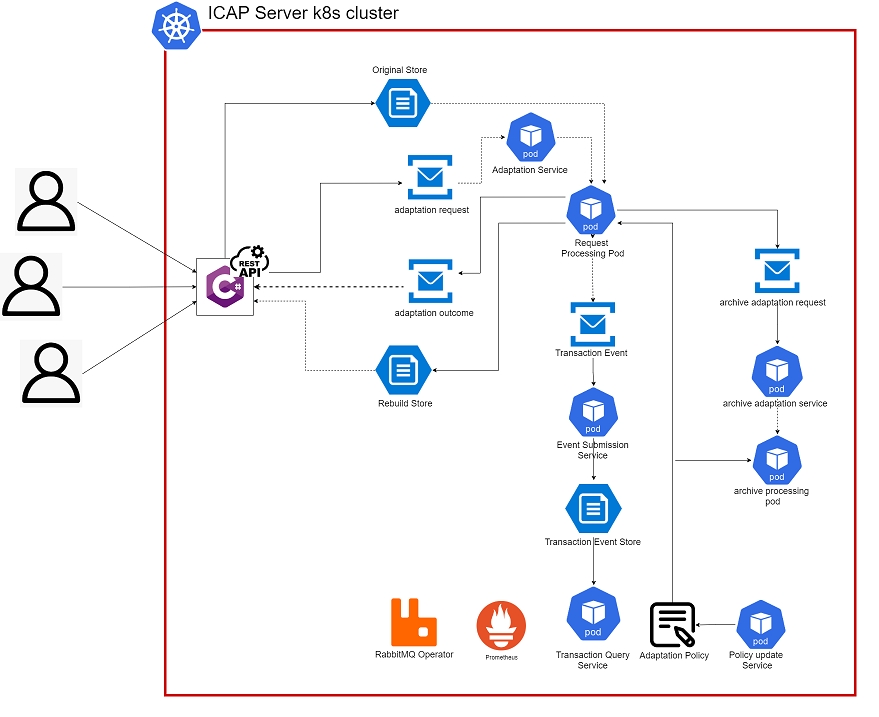
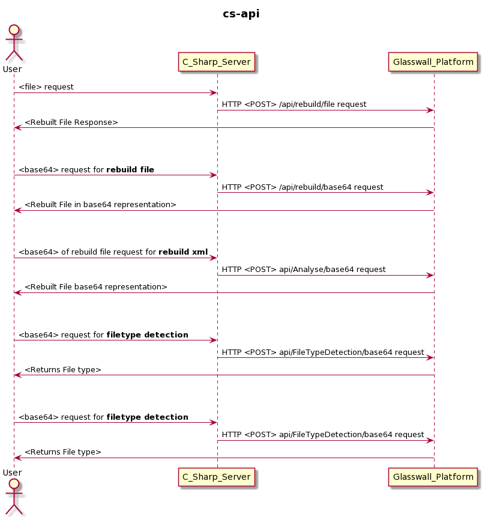
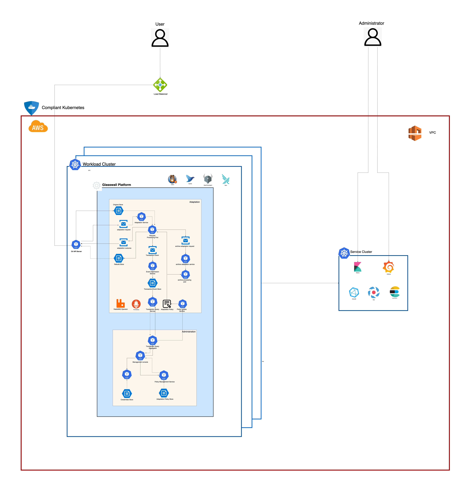
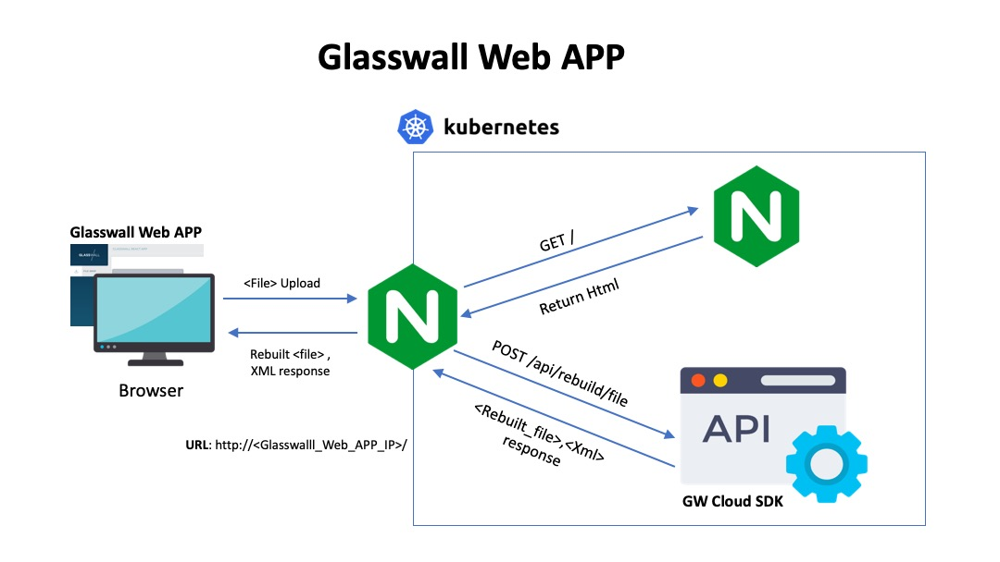
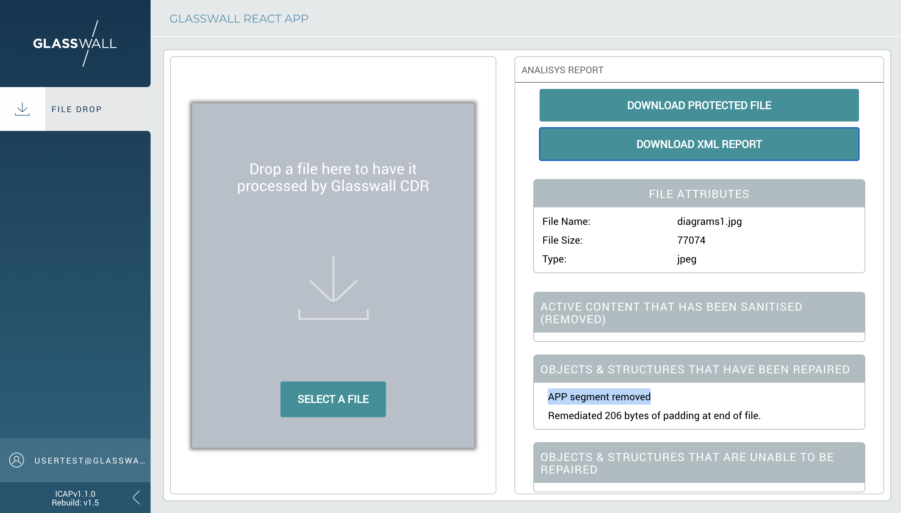

# Glasswall Cloud SDK

## Architecture Overview

- Implemented as a K8s service
- Easy to deploy within ICAP Service cluster
- Interacts with Adaptation Service with RabbitMQ
- Accessible on <Cluster IP>:8080

## Architecture Diagram



- The C# service receives files for a rebuild on the REST API endpoints.  
- After preliminary processing (at least must verify the file has been received) the request is passed to the `Adaption Service` with `Adaption request` RabbitMQ     message.  
- The file to be rebuilt is uploaded to the `Original Store`.  
- Once the processing is completed C# service gets informed with a RabbitMQ `Adaption outcome` message.  
- C# service get the rebuilt file from the `Rebuild Store` and passes it to the user.  

## Dataflow Diagram.



## Endpoints

| API Endpoint | Method | Description | 
|------|---------|---------    |
| /api/FileTypeDetection/base64    | POST |  /api/FileTypeDetection/base64 |
| /api/rebuild/file    | POST |  Rebuilds a file using its binary data       |
| /api/rebuild/base64   | POST | Rebuilds a file using the Base64 encoded representation |
| /api/rebuild/base64   | POST | Analyse a file using the Base64 encoded representation |

### Detailed API Endpoints Documentation - [ Link ](./ApiEndpointsDocumentation.md)

## Deployment of Glasswall Cloud SDK within ICAP Service cluster

- Make sure you can connect to the cluster with `kubectl`  
- For the case of [AMI or OVA](https://github.com/k8-proxy/glasswall-servers-eval/wiki) just SSH to the EC2 instance or the VM
- For other deployments see [Accessing Clusters](https://kubernetes.io/docs/tasks/access-application-cluster/access-cluster/))

- Get [deployment.yaml](https://github.com/k8-proxy/cs-k8s-api/blob/main/deployment.yaml)

    ```
        wget https://raw.githubusercontent.com/k8-proxy/cs-k8s-api/main/deployment.yaml
    ```
- Replace `<REPLACE_IMAGE_ID>` within the file with the tagged (`<dockerhub_repo>/cs-k8s-api:<version>`) docker hub image created in the previous section  

- Run the following:

    ```
        kubectl -n icap-adaptation apply -f deployment.yaml
    ```

- The command above must create a Kubernetes service called `proxy-rest-api` that can be accessed at <Cluster_IPv4>:8080  

- Verify the service has been successfully created  

    ```
        kubectl -n icap-adaptation get svc
    ```

- The output should contain a line that looks like the following:

    ```
        ...
        proxy-rest-api              LoadBalancer   10.43.236.137   91.109.25.86   8080:30329/TCP
        ...
    ```

- Verify that the service POD is running  

    ```
        kubectl -n icap-adaptation get pods
    ```
- You should see the POD in the `Running` state  

    ```
        proxy-rest-api-7b7d5b6456-s44kq                         1/1     Running     0
    
## Glasswall Cloud SDK with Compliant Kubernetes

### **Repository: https://github.com/k8-proxy/k8s-compliant-kubernetes/tree/cs-api**



### Existing Cloud SDK in Complaint Kubernetes can be upgraded as explained below:
- SSH into Workload Cluster Instance
- Switch to sudo user using `sudo su`
- Get docker image tag of Cloud SDK from https://github.com/k8-proxy/cs-k8s-api/actions. Select any run and navigate to `Push image` step
- Every time code is pushed to main branch, two images are built and pushed to GW docker repository. `latest` refers to latest version of Cloud SDK and `main-<commit-id>` refers to specific version
  ```
  main-a47f080: digest: sha256:5b70ea91347bbd2ded4d87d5b9fbf9d7c20cc8c3a76fd004f49a2fd6492e01c2 size: 2424
  ```
- Once tag of required version of docker image is copied, execute below commands in Workload cluster instance. Replace `<image-tag>` with required version of Cloud SDK
  ```
        kubectl set image deployment/proxy-rest-api proxy-rest-api=glasswallsolutions/cs-k8s-api:<image-tag> -n icap-adaptation
        kubectl rollout restart deployment proxy-rest-api -n icap-adaptation
  ```
- Creation of new pod with required version of Cloud SDK can be verified by executing `kubectl get pods -n icap-adaptation`
## FileDrop with Glasswall Cloud SDK



## Integration of Glasswall Cloud SDK with FileDrop
- Clone Repo

    ```
    git clone https://github.com/k8-proxy/k8-rebuild-file-drop
    cd k8-rebuild-file-drop/app
    ```
- Edit Dockerfile 
    ```
    vim Dockerfile
    ```
- Update endpoints with c# api endpoints in below three lines
    ```
    ARG REACT_APP_ANALYSE_API_ENDPOINT='http://compliantk8sicaplb-6921a9b8d2e49b4f.elb.eu-west-1.amazonaws.com:1346'
    ARG REACT_APP_FILETYPEDETECTION_API_ENDPOINT='http://compliantk8sicaplb-6921a9b8d2e49b4f.elb.eu-west-1.amazonaws.com:1346'
    ARG REACT_APP_REBUILD_API_ENDPOINT='http://compliantk8sicaplb-6921a9b8d2e49b4f.elb.eu-west-1.amazonaws.com:1346'
    ```
- Run : `docker build -t k8-rebuild-file-drop .`
- Run: `docker run -it --rm -p 80:80 k8-rebuild-file-drop`
- Open the `http://localhost` in your Browser
- You will be able to see File Drop, React App web interface

    

- How to use file-drop [ Link ](https://github.com/k8-proxy/glasswall-servers-eval/wiki/How-to-use-File-Drop)


Note : To Deploy in AWS, an AMI needs to be created with above setup.
    
    
    
    
    
